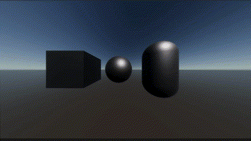

# Dissolve-Shader
Dissolve shader created using Shader Graph in Unity 2022.3.6f1. 
Custom materials that use DissolveShader.shader will work as intended.

## Showcase
|Style|Image|
|:--:|:--:|
|Shader | |
